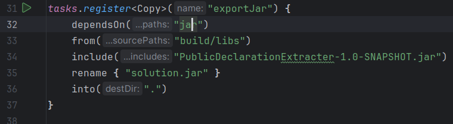

# PublicDeclarationExtracter

A Kotlin-based CLI tool that extracts and prints **all public declarations** from a Kotlin codebase.

This tool was built with a Kotlin compiler PSI via `kotlin-compiler-embeddable`, no extra libraries or plugins.
For convenient UX, this can be built as a self-contained JAR `solution.jar`. I included a wrapper shell script `solution.sh` that runs the JAR.

---
## How to build
Open the project in IntelliJ IDEA, open ```build.gradle.kts``` and run the following task by clicking the green arrow button:\
\
This will create the ```solution.jar``` in the same folder as this README and the script ```solution.sh```.
## How to run

Provide the program with a path to any Kotlin codebase and run the JAR:

```bash
git clone https://github.com/JetBrains/Exposed
chmod +x ./solution
./solution ./Exposed
```
or instead of using the wrapper, you can just:
```declarative
java -jar solution.jar ./Exposed
```

## Example
### Input file
```Kotlin
package sample

fun apiFunction() {}

private fun hiddenFunction() {}

object RootObject {
    val value = 123

    fun objectFunction() {}

    private class PrivateHelper {
        fun helperLogic() {}
    }

    companion object {
        fun companionVisible() {}
    }
}

sealed class Shape {
    class Circle(val radius: Double) : Shape()
    object Square : Shape()
}

class Container {
    fun exposedMethod() {}

    private fun privateMethod() {}

    class Nested {
        fun deep() {
            fun localHelper() {} // should be skipped
        }
    }
}

enum class Mode {
    BASIC,
    ADVANCED {
        fun advancedOnly() {} // shouldn't be detected
    }
}

interface Reporter {
    fun report()
}

typealias ID = String

```
### Output
```Kotlin
fun apiFunction()
object RootObject {
    val value
    fun objectFunction()
    object Companion {
        fun companionVisible()
    }
}
sealed class Shape {
    class Circle {
    }
    object Square {
    }
}
class Container {
    fun exposedMethod()
    class Nested {
        fun deep()
    }
}
enum class Mode {
    enum entry BASIC
    enum entry ADVANCED
}
interface Reporter {
    fun report()
}
typealias ID

```
